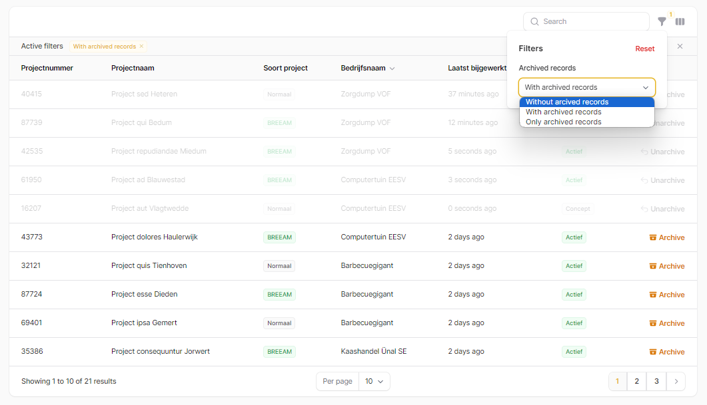

# Filament plugin to archive, unarchive and filter records

[](https://packagist.org/packages/okeonline/filament-archivable)
[](https://github.com/okeonline/filament-archivable/actions?query=workflow%3Arun-tests+branch%3Amain)
[](https://github.com/okeonline/filament-archivable/actions?query=workflow%3A"Fix+PHP+code+style+issues"+branch%3Amain)
[](https://packagist.org/packages/okeonline/filament-archivable)

Filament plugin for archiving and unarchiving table records (eloquent models) based on the [Laravel Archivable package by Joe Butcher](https://github.com/joelbutcher/laravel-archivable). 

This filament plugin adds an [ArchiveAction](#archiveunarchive-actions), an [UnArchiveAction](#archiveunarchive-actions) and a [ArchivedFilter](#filtering) to your resource tables. It's also possible to [add custom row-classes for archived records](#add-custom-classes-to-archived-rows).

## Requirements

- PHP ^8.3
- Laravel ^11.0
- Filament ^3.0
- Laravel Archivable ^1.4 (installed with this plugin)

## Installation

You can install the package via composer:

```bash
composer require okeonline/filament-archivable
```

Then, add the plugin to the ```AppPanelProvider```:

```php
class AppPanelProvider extends PanelProvider
{
    public function panel(Panel $panel): Panel
    {
        return $panel
            // ...
            ->plugin(\Okeonline\FilamentArchivable\FilamentArchivablePlugin::make());
    }
}
```

This filament plugin automatically installs the [Laravel Archivable package by Joe Butcher](https://github.com/joelbutcher/laravel-archivable).

Follow his installation instructions, which -in short- instructs:

1) Add a ```archived_at``` column to your table
2) Use the ```Archivable```-trait on your model

## Usage

### Archive and Unarchive actions
As soon as the ```Archivable```-trait from the [Laravel Archivable package](#installation) is added to the model, it is possible to add the following actions to the corresponding resource table:

```php

use Okeonline\FilamentArchivable\Tables\Actions\ArchiveAction;
use Okeonline\FilamentArchivable\Tables\Actions\UnArchiveAction;
// ...

class UserResource extends Resource
{
    // ...
    public static function table(Table $table): Table
    {
        return $table
            // ...
            ->actions([
                ArchiveAction::make(),
                UnArchiveAction::make(),
            ]);
    }
}
```

It will show the ```ArchiveAction``` on records that aren't archived, and will show the ```UnArchiveAction``` on those which are currently archived:


> You should add **both** actions to the same table. The action itself wil determine if it should be shown on the record.

The actions are normal table actions, similar to the [Delete](https://filamentphp.com/docs/3.x/actions/prebuilt-actions/delete) and [Restore](https://filamentphp.com/docs/3.x/actions/prebuilt-actions/restore) actions of FilamentPHP. You can add all features that are described in the [FilamentPHP Table Actions Documentation](https://filamentphp.com/docs/3.x/tables/actions), like:

- ```hiddenLabel()```
- ```tooltip()```
- ```disabled()```
- ```icon()```
- ... etc.

```php
ArchiveAction::make()
    ->hiddenLabel()
    ->tooltip('Archive'),
```

The actions call the ```$model->archive()```  and ```$model->unArchive()``` methods that are provided by the [Laravel Achivable package](https://github.com/joelbutcher/laravel-archivable?tab=readme-ov-file#extensions).

### Filtering

It is also possible to add a ```ArchivedFilter``` to the resoucre table, which adds three filtering options:
- Show only unarchived records
- Show only archived records
- Show both
   
> By default, an unfiltered table will only show the unarchived records, as the Laravel Archivable package comes with a default global scope to query records with ```archived_at IS NULL```

You can add the filter by adding ```ArchivedFilter``` to your array of resource table filters:

```php
use Okeonline\FilamentArchivable\Tables\Filters\ArchivedFilter;

public static function table(Table $table): Table
{
    return $table
        // ...
        ->filters([
            ArchivedFilter::make(),
        ]);
}
```


The ```ArchivedFilter``` will respect all options that Tenary Filters have, so check the [Tenary Filter Documentation of Filament](https://filamentphp.com/docs/3.x/tables/filters/ternary) to customize the filter.

### Add custom classes to archived rows

This plugin comes with a ```Table::macro``` which allows you to add custom (CSS/Tailwind) classes to ***table-rows** that are archived*:

Just add the method ```->archivedRecordClasses()``` to your table with archived results.

```php
public static function table(Table $table): Table
{
    return $table
        ->archivedRecordClasses(['opacity-25']);
}
```


## Supported languages

- en - English
- nl - Dutch

You can publish and change the language files by running:

```bash
php artisan vendor:publish --tag=filament-archivable-translations
```

## Testing

Minimal dev-requirement:
- filament/tables ^3.2.57

```bash
composer test
```

## Changelog

Please see [CHANGELOG](CHANGELOG.md) for more information on what has changed recently.

## Security Vulnerabilities

Please review [our security policy](../../security/policy) on how to report security vulnerabilities.

## Credits

- [Rudi van Zandwijk](https://github.com/rvzug)
- [All Contributors](../../contributors)

## License

The MIT License (MIT). Please see [License File](LICENSE.md) for more information.
